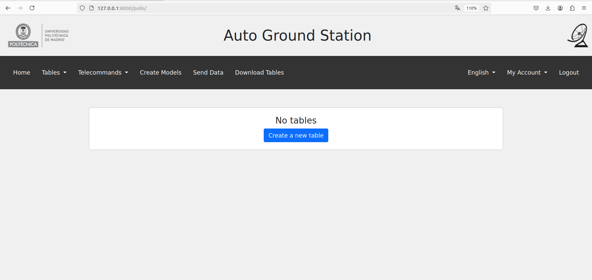
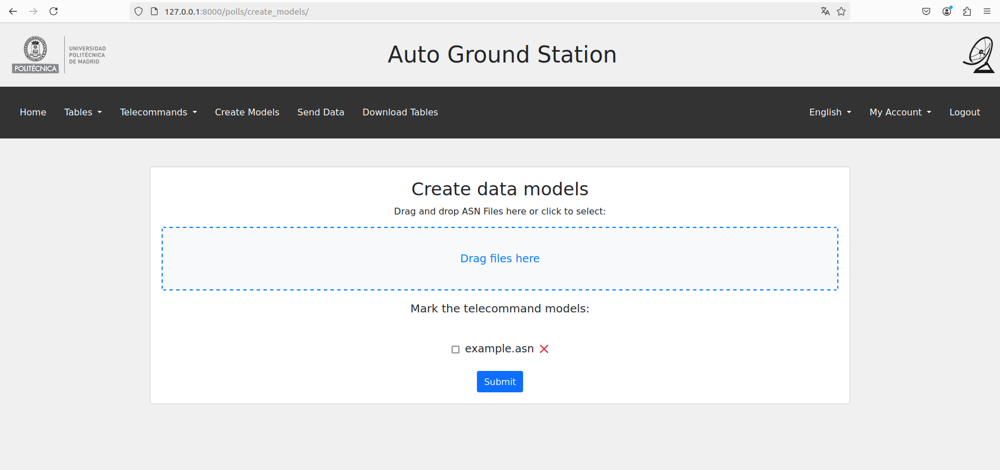

# Auto Ground Station

>[!NOTE] 
>In progress
>

This project is a Ground Station platform that includes a web application, databases for user management and satellite data storage, and an API integrated with an ASN.1 compiler. The API is responsible for generating database tables and inserting data received in ASN.1 and CSV formats. The system is designed to efficiently handle satellite telemetry and telecommand data, ensuring data integrity and security.


## Kubernetes Cluster Deployment

This guide explains how to install Ansible, generate SSH keys, distribute them across the nodes, and set up a Kubernetes cluster using Ansible playbooks.

### 1. Install Ansible

First, install Ansible on your control machine (usually your local machine or the master node).

For Ubuntu:
```bash
sudo apt update
sudo apt install ansible -y
```

For other distributions, follow the official [Ansible installation guide](https://docs.ansible.com/ansible/latest/installation_guide/intro_installation.html).

### 2. Generate SSH Keys

To communicate with your remote nodes (master and workers) without passwords, generate SSH keys on your control machine:

```bash
ssh-keygen -t rsa -b 4096 -N '' -f ~/.ssh/id_rsa
```

This will create a public key (`id_rsa.pub`) and a private key (`id_rsa`) in the `~/.ssh` directory.

### 3. Distribute SSH Keys to Nodes

You need to distribute the SSH public key (`id_rsa.pub`) to each of the nodes (master and workers). This allows the control machine to connect to them without requiring a password each time.

You can either manually copy the SSH key to each node:
```bash
ssh-copy-id user@node_ip_address
```

Or, use Ansible to distribute the keys automatically. Ensure your `hosts.ini` file contains the IPs of all your nodes and the username of the user you want to use to connect to the nodes:

```ini
[all]
master ansible_host=xxx.xxx.xxx.xxx
worker1 ansible_host=xxx.xxx.xxx.xxx
worker2 ansible_host=xxx.xxx.xxx.xxx

[master]
master

[workers]
worker1
worker2

[all:vars]
ansible_user=username
ansible_python_interpreter=/usr/bin/python3
```

Run an Ansible playbook (`ssh-keys.yml`) to distribute the SSH keys

```bash
ansible-playbook -i hosts.ini ssh-keys.yml
```

### 4. Create the Kubernetes Cluster

Now that SSH access is set up, you can create the Kubernetes cluster. Use the provided playbook to configure the firewall, install Docker, and set up Kubernetes on all nodes.

Run the following playbook (`k8s-cluster.yml`) to install and configure the Kubernetes cluster:
```bash
ansible-playbook -i hosts.ini k8s-cluster.yml --ask-become-pass
```

>[!NOTE]
> The --ask-become-pass option is used to avoid entering the sudo password for each command.

This playbook will:
- Allow necessary ports through the firewall
- Install Docker and containerd
- Install Kubernetes components (`kubeadm`, `kubectl`, `kubelet`)
- Initialize the Kubernetes master node and retrieve the join command for the worker nodes
- Join the worker nodes to the master to form the cluster
- Install the Calico network plugin

### 5. Verify the Cluster

Once the playbook has finished running, you can verify the cluster setup by logging into the master node and running the following command:

```bash
kubectl get nodes -o wide
```

You should see the master and worker nodes listed, indicating the cluster is running successfully.

## Application Deployment in Kubernetes

To deploy the application within a Kubernetes cluster, use the `auto-gs.py` script. This script automates the deployment process, ensuring that all components are set up correctly. The primary deployment command is:

### Deployment Command

```bash
python3 auto-gs.py -create 3 -rf 3
```

- **`-create n`:** Deploys the application with `n` replicas of the Cassandra pods.
- **`-rf n` (optional):** Specifies the replication factor for Cassandra. If not provided, a default value of 3 is used.

>[!IMPORTANT]
>The number of Cassandra pods must be equal or lower than the number of Kubernetes nodes.

>[!IMPORTANT]
>The replication factor must be set to a value lower than the number of Cassandra nodes.

## Creating Tables and Inserting Data

After deployment, data can be managed either through the web application or directly by accessing the containers.





### Commands for direct management

- **Copy ASN.1 Files:**

  ```bash
  python3 auto-gs.py -cpASN file
  ```

  Copies ASN.1 files to the `asn1scc` pod in the `/dmt/filesASN1/` directory.

- **Copy CSV Files:**

  ```bash
  python3 auto-gs.py -cpCSV file
  ```

  Copies CSV files to the `asn1scc` pod in the `/dmt/filesCSV/` directory.

- **Open ASN.1 Compiler Console:**

  ```bash
  python3 auto-gs.py -asn
  ```

  Opens an interactive console within the `asn1scc` pod.

- **Open Web Application Console:**

  ```bash
  python3 auto-gs.py -web
  ```

  Opens a console in the `web` pod for web application management.

### ASN.1 Compiler Commands

The ASN.1 compiler is used to create database tables and insert data into Cassandra. Here are the essential commands:

1. **Create Data Model:**

     This command compiles ASN.1 files into a data model, creating tables in the specified keyspace.

   ```bash
   python3 /src/asn2dataModel.py -modulesTelecommand "DataTypes-Telecommands" -keyspace tfm -contact_points cassandra -clusterPort 9042 ./filesASN1 DataTypesTelecommands.asn DataTypes-Telemetries.asn
   ```
  >[!TIP]
  >The `-modulesTelecommand` parameter is optional and can be omitted if the telecommand data is not required.
  

2. **Insert Telemetry/Telecommand Data:**

     This command inserts data from CSV files into the corresponding tables.

   ```bash
   python3 /src/ReadWriteTMTC/readCSV.py ./filesCSV -keyspace tfm -contact_points cassandra -clusterPort 9042 -filesTelecommands datatypes_telecommands.csv
   ```

3. **Create Telecommand CSV:**
   
    Generates a CSV file from the specified tables, which can be sent as a telecommand.

   ```bash
   python3 /src/ReadWriteTMTC/createCSV.py ./filesTelecommand "datatypes_telecommands" -keyspace tfm -contact_points cassandra -clusterPort 9042 -sendTelecommands True
   ```
   
  >[!TIP]
  >The `-sendTelecommands` parameter is optional by default is set to `False`.

For more information go to [Compiler Usage Guide](CompilerUsageGuide.md).
