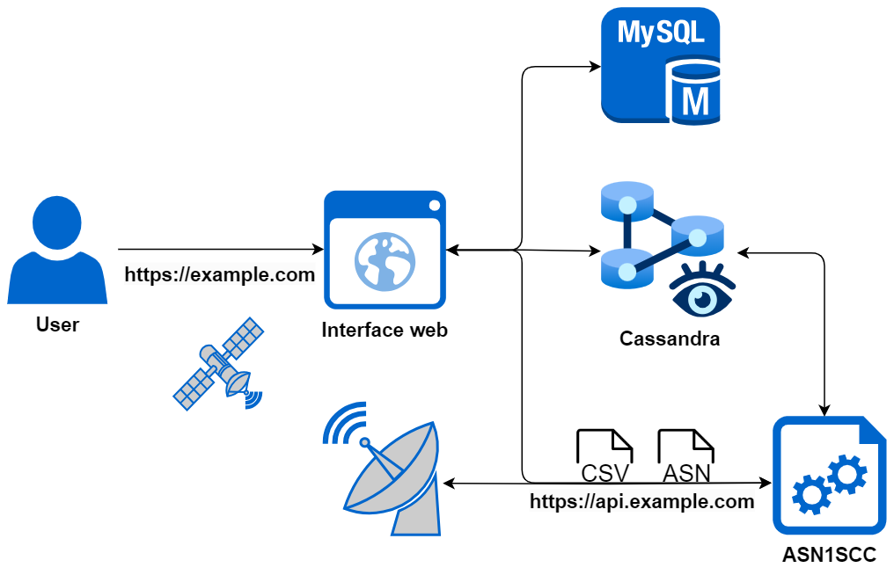

# Auto Ground Station

This project is a Ground Station platform that includes a web application, databases for user management and satellite data storage, and an API integrated with an ASN.1 compiler. The API is responsible for generating database tables and inserting data received in ASN.1 and CSV formats. The system is designed to efficiently handle satellite telemetry and telecommand data, ensuring data integrity and security.



## Kubernetes Cluster Deployment

*This section is under construction.*

>[!NOTE] 
>In progress
>
## Application Deployment in Kubernetes

To deploy the application within a Kubernetes cluster, use the `auto-gs.py` script. This script automates the deployment process, ensuring that all components are set up correctly. The primary deployment command is:

### Deployment Command

```bash
python3 auto-gs.py -create 3 -rf 3
```

- **`-create n`:** Deploys the application with `n` replicas of the Cassandra pods.
- **`-rf n` (optional):** Specifies the replication factor for Cassandra. If not provided, a default value of 3 is used.

>[!IMPORTANT]
>The replication factor must be set to a value lower than the number of Cassandra nodes.

## Creating and Inserting Data

After deployment, data can be managed either through the web application or directly by accessing the containers. Here are the key commands for direct data management:

- **Copy ASN.1 Files:**

  ```bash
  python3 auto-gs.py -cpASN file
  ```

  Copies ASN.1 files to the `asn1scc` pod in the `/dmt/filesASN1/` directory.

- **Copy CSV Files:**

  ```bash
  python3 auto-gs.py -cpCSV file
  ```

  Copies CSV files to the `asn1scc` pod in the `/dmt/filesCSV/` directory.

- **Open ASN.1 Compiler Console:**

  ```bash
  python3 auto-gs.py -asn
  ```

  Opens an interactive console within the `asn1scc` pod.

- **Open Web Application Console:**

  ```bash
  python3 auto-gs.py -web
  ```

  Opens a console in the `web` pod for web application management.

### ASN.1 Compiler Commands

The ASN.1 compiler is used to create database tables and insert data into Cassandra. Here are the essential commands:

1. **Create Data Model:**

   ```bash
   python3 /src/asn2dataModel.py -modulesTelecommand "DataTypes-Telecommands" -keyspace tfm -contact_points cassandra -clusterPort 9042 ./filesASN1 DataTypesTelecommands.asn DataTypes-Telemetries.asn
   ```
  >[!NOTE]
  >The `-modulesTelecommand` parameter is optional and can be omitted if the telecommand data is not required.
  
   This command compiles ASN.1 files into a data model, creating tables in the specified keyspace.

2. **Insert Telemetry/Telecommand Data:**

   ```bash
   python3 /src/ReadWriteTMTC/readCSV.py ./filesCSV -keyspace tfm -contact_points cassandra -clusterPort 9042 -filesTelecommands datatypes_telecommands.csv
   ```

   This command inserts data from CSV files into the corresponding tables.

3. **Create Telecommand CSV:**

   ```bash
   python3 /src/ReadWriteTMTC/createCSV.py ./filesTelecommand "datatypes_telecommands" -keyspace tfm -contact_points cassandra -clusterPort 9042 -sendTelecommands True
   ```
  >[!NOTE]
  >The `-sendTelecommands` parameter is optional by default is set to `False`.

   Generates a CSV file from the specified tables, which can be sent as a telecommand.

These commands allow for efficient data management within the Ground Station platform, ensuring that satellite telemetry and telecommand data are correctly processed and stored.
